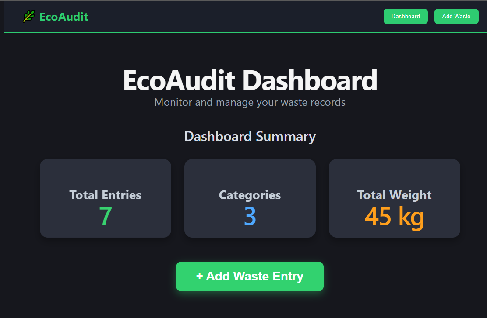
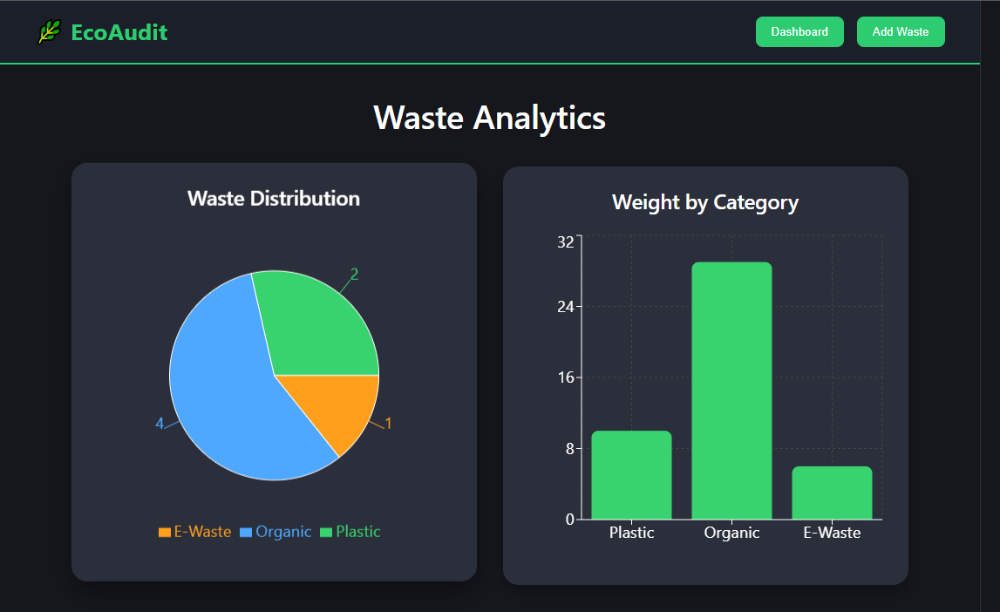
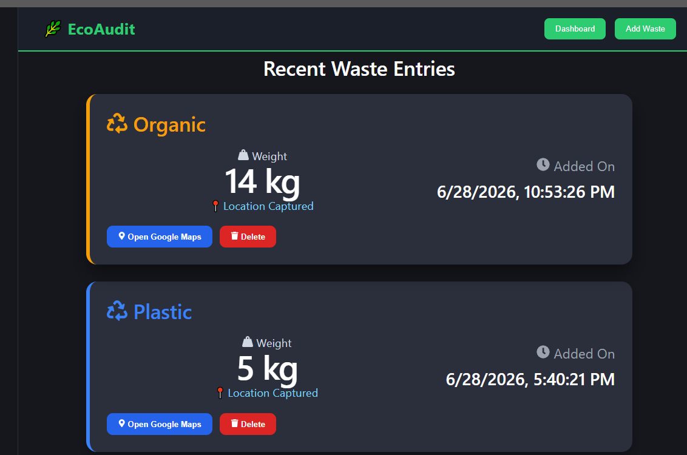
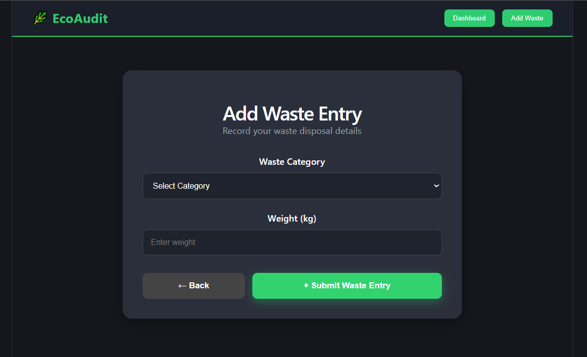

# 🌿 EcoAudit Waste Logger

A modern React + Firebase web application for logging, managing, and analyzing waste disposal records. The project enables users to record waste entries, capture their current location, visualize waste statistics through charts, and manage records with an intuitive dashboard.

---

## 🚀 Live Demo

🔗 **Live Website:** https://eco-audit-waste-logger.vercel.app

🔗 **GitHub Repository:** https://github.com/tarangg0601-arch/EcoAudit-Waste-Logger

---

# 📌 Project Overview

EcoAudit Waste Logger is designed to simplify waste tracking and encourage better waste management practices.

The application allows users to:

- Record different categories of waste
- Store disposal location using GPS
- View waste statistics
- Search and filter waste records
- Delete unnecessary records
- Open disposal locations directly in Google Maps

All records are securely stored in Firebase Firestore and are accessible through a clean and responsive dashboard.

---

# ✨ Features

### 📝 Waste Management

- Add Waste Entry
- Delete Waste Entry
- Real-time Firestore Storage
- Automatic Timestamp Recording

### 📍 Geolocation

- Capture Current Location
- Store Latitude & Longitude
- Open Saved Location in Google Maps

### 📊 Dashboard Analytics

- Dashboard Summary
- Total Waste Entries
- Total Categories
- Total Waste Weight

### 📈 Data Visualization

- Pie Chart (Waste Distribution)
- Bar Chart (Weight by Category)

### 🔍 Search & Filtering

- Search Waste Category
- Filter by Waste Category

### 🎨 User Interface

- Modern Dark Theme
- Responsive Design
- Hover Effects
- Professional Dashboard Layout
- Sticky Navigation Bar
- Footer

### ☁ Deployment

- Hosted on Vercel
- Connected with GitHub for Automatic Deployment

---

# 🛠 Tech Stack

## Frontend

- React.js
- Vite
- React Router DOM
- React Icons

## Backend

- Firebase Firestore

## Charts

- Recharts

## Deployment

- Vercel

---

# 📂 Project Structure

```
EcoAudit-Waste-Logger
│
├── public/
├── src/
│   ├── assets/
│   ├── components/
│   │   ├── Analytics.jsx
│   │   ├── BarCharts.jsx
│   │   ├── Navbar.jsx
│   │   ├── PieCharts.jsx
│   │   ├── SummaryCard.jsx
│   │   ├── WasteCard.jsx
│   │   └── WasteForm.jsx
│   │
│   ├── firebase/
│   │   └── firebaseConfig.js
│   │
│   ├── pages/
│   │   ├── Dashboard.jsx
│   │   └── AddWaste.jsx
│   │
│   ├── services/
│   │   └── database.js
│   │
│   ├── styles/
│   ├── App.jsx
│   └── main.jsx
│
├── package.json
├── README.md
└── vite.config.js
```

---

# ⚙ Installation

Clone the repository

```bash
git clone https://github.com/tarangg0601-arch/EcoAudit-Waste-Logger.git
```

Move into the project

```bash
cd EcoAudit-Waste-Logger
```

Install dependencies

```bash
npm install
```

Run the development server

```bash
npm run dev
```

Build for production

```bash
npm run build
```

---

# 🔥 Firebase Configuration

Create a Firebase project.

Enable **Cloud Firestore**.

Replace the Firebase configuration inside:

```
src/firebase/firebaseConfig.js
```

with your own Firebase credentials.

---

# 📊 Database Schema

Each waste entry contains:

| Field | Type |
|--------|------|
| category | String |
| weight | Number |
| latitude | Number |
| longitude | Number |
| createdAt | Timestamp |

---

# 📸 Screenshots

## Dashboard



---

## Analytics



---

## Waste Entries



---

## Add Waste Form



# 🌍 Future Enhancements

- User Authentication
- Admin Dashboard
- Waste Collection Scheduling
- AI-based Waste Classification
- Image Upload Support
- PDF/CSV Report Export
- Email Notifications
- Mobile Application
- Real-time Analytics
- Waste Prediction using Machine Learning

---

# 🎯 Learning Outcomes

Through this project, the following concepts were implemented:

- React Components
- React Hooks
- React Router
- Firebase Firestore
- CRUD Operations
- Geolocation API
- Google Maps Integration
- Data Visualization
- Responsive UI Design
- Deployment using Vercel

---

# 👨‍💻 Author

**Tarang Gupta**

Engineering Student

---

# 📄 License

This project is developed for educational purposes.

© 2026 EcoAudit Waste Logger. All Rights Reserved.